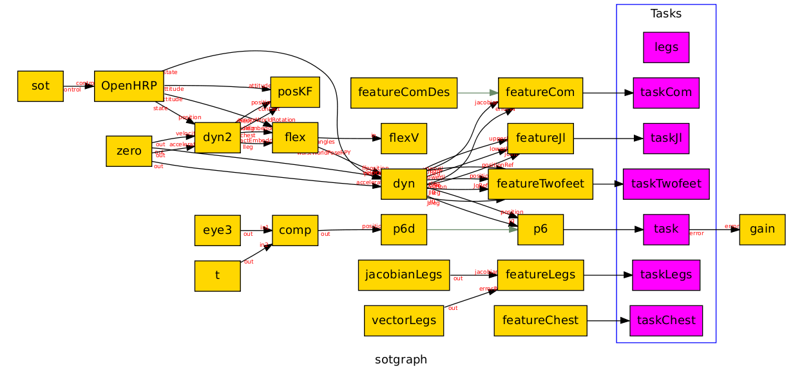

Examples
********

.. toctree::
   :maxdepth: 3

StackOfTasks display client
===========================

0. Install robot-viewr, prefer preferably with ``robotpkg``

1. Make sure you have omniORB up and running. Start omniNames if necessary::

     $ pgrep omniNames || omniNames

2. Start the display server::

     $ robotviewer

3. Start sot shell and run ``simu``, ``coshell`` scripts respectively. In this example sot is installed in ``/local/nddang/openrobots/``, in your system,
change accordingly::

     $ rlwrap $ROBOTPKG_BASE/bin/sot/test_shell                
     > run /local/nddang/openrobots/script/simu
     Creating the standard dynamic 
     > run /local/nddang/openrobots/script/coshell
     Warning naming context already bound

Internally, these two scripts create the following structure in sot. Don't worry about it yet.

4. On another terminal, start the bridge::

     $ rv-sot-bridge

   which should fetch robot state from the sot and send display command to
   robotviewer server. Hopefully you get something like this:

   .. image:: ../images/ex1b.png
    :width: 600px
    :align: center

   rv-sot-bridge will complain because the simu robot is not running yet.

5. Go back to shell in step 3 and add hand task (named task) to the sot::

   > sot.push task

   Increment the simu robot by 0.01s. You should see now that the robot updated
   in ``robotviewer`` window.

   .. image:: ../images/ex1c.png
    :width: 600px
    :align: center

   Now, use a for loop in sot to run a simulation::

       > for i=1:1000 OpenHRP.inc 0.01

   The simu robot should move to achieve that task you've just gave it
   

   .. image:: ../images/ex1d.png
    :width: 600px
    :align: center

Local-stepper client
====================

This client is used to display robot path using ``hpp-localstepper`` software

   .. image:: ../images/ex2.png
    :width: 600px
    :align: center
